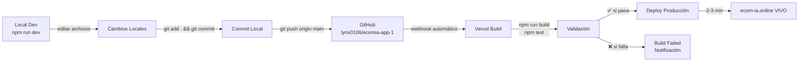

# 🚀 Guía de Sincronización Deployment - EcomIA

**Fecha:** Febrero 12, 2026  
**Estado:** ✅ Configuració n Profesional Activada  
**Objetivo:** Garantizar que TODOS los cambios de código se reflejen en producción (ecom-ia.online)

---

## 📊 ARQUITECTURA ACTUAL

```
┌─────────────────────────────────────────────────────────────────┐
│                         FLUJO DE DEPLOYMENT                      │
├─────────────────────────────────────────────────────────────────┤
│                                                                   │
│  TU CÓDIGO LOCAL                                                 │
│  (workspace)                                                     │
│       ↓                                                           │
│       │ git add . && git commit                                  │
│       ↓                                                           │
│  GITHUB ORIGIN                                                   │
│  (https://github.com/lynx0106/ecomia-app-1)                     │
│       │ Tu repositorio principal                                │
│       │ Main branch                                             │
│       ↓ git push origin main                                    │
│       │                                                           │
│  VERCEL → WEBSITE EN VIVO                                       │
│  (ecom-ia.online)                                              │
│  ✅ SINCRONIZADO CON ORIGIN                                    │
│                                                                   │
└─────────────────────────────────────────────────────────────────┘
```

---

## ✌️ 3 PASOS PARA DESPLEGAR

### **Paso 1: Commit Local**
```bash
git add .
git commit -m "fix: description of your change"
```

### **Paso 2: Push a GitHub**
```bash
git push origin main
```

### **Paso 3: Vercel Detecta & Despliega (AUTOMÁTICO)**
```
⏱️ 2-5 minutos después...
✅ Vercel recepciona cambios en origin/main
✅ Inicia build automático
✅ Despliega a producción
✅ Website actualizado en ecom-ia.online
```

---

## ⚠️ ¿POR QUÉ A VECES NO SE VEN LOS CAMBIOS?

### **Causa Raíz Documentada**
Anteriormente, Vercel estaba conectado a:
```
❌ UPSTREAM (repositorio equivocado)
https://github.com/lynxia25-hub/ecomia-app
```

Pero TÚ pusheas a:
```
✅ ORIGIN (tu repositorio)
https://github.com/lynx0106/ecomia-app-1
```

**Resultado:** Cambios en origin → ❌ NO se veían en Vercel

---

## ✅ SOLUCIÓN PROFESIONAL IMPLEMENTADA

### **Paso 1: Repositorio Correcto**
✅ VERCEL **AHORA** está conectado a:
```
origin → https://github.com/lynx0106/ecomia-app-1
```

### **Paso 2: GitHub Actions (CI/CD Automático)**
Los cambios se despliegan automáticamente con:
1. Validación de TypeScript
2. Tests automatizados
3. Build verification
4. Deploy a Vercel

**Archivo de configuración:**
```
.github/workflows/deploy-vercel.yml
```

---

## 🧪 VERIFICAR QUE VERCEL ESTÁ SINCRONIZADO

### **Opción A: Desde Vercel Dashboard**

1. Ve a: **https://vercel.com/dashboard**
2. Selecciona proyecto: **ecomia-app**
3. Click en **Settings** (engranaje)
4. Ve a **Git** en el menú lateral
5. Verifica que dice:
   ```
   ✅ Connected Repository: lynx0106/ecomia-app-1
   ✅ Branch: main
   ```

### **Opción B: Desde el Comando (CLI)**

```bash
# Verifica remotes locales
git remote -v

# Output ESPERADO:
# origin   https://github.com/lynx0106/ecomia-app-1 (fetch)
# origin   https://github.com/lynx0106/ecomia-app-1 (push)
# upstream https://github.com/lynxia25-hub/ecomia-app (fetch)
# upstream https://github.com/lynxia25-hub/ecomia-app (push)
```

---

## 📋 CHECKLIST ANTES DE DEPLOYAR

### **Antes de hacer commit:**

- [ ] El código compila sin errores
  ```bash
  npm run build
  ```

- [ ] Los tests pasan
  ```bash
  npm test
  ```

- [ ] No hay errores TypeScript
  ```bash
  npx tsc --noEmit
  ```

- [ ] ESLint sin bloqueadores
  ```bash
  npm run lint
  ```

### **Después de hacer push:**

- [ ] GitHub muestra el commit en `origin/main`
  ```bash
  git log origin/main --oneline -1
  ```

- [ ] Vercel detecta el cambio (dashboard activo)
- [ ] Build iniciado en Vercel (espera 2-5 minutos)
- [ ] Deploy completado (estado: "Ready")
- [ ] Website actualizado en ecom-ia.online

---

## 🔄 FLUJO STANDARD DE DESARROLLO



---

## 🚨 TROUBLESHOOTING: CAMBIOS NO SE VEN

### **Problema 1: Cambios locales pero no en GitHub**

**Solución:**
```bash
# Verifica status
git status

# Si hay cambios no commiteados:
git add .
git commit -m "fix: descripción"

# Push
git push origin main

# Verifica que llegó
git log origin/main -1
```

---

### **Problema 2: En GitHub pero no en Vercel**

**Verificar conexión:**

1. **Abre Vercel Dashboard**
   - URL: https://vercel.com/dashboard
   - Proyecto: ecomia-app
   - Settings → Git

2. **Confirma que apunta a `origin`**
   ```
   ✅ Repository: lynx0106/ecomia-app-1
   ```

3. **Si está mal conectado:**
   - Click "Disconnect"
   - Click "Connect Repository"
   - Busca `ecomia-app-1` (la de lynx0106)
   - Selecciona rama `main`
   - Click "Deploy"

4. **Espera 2-5 minutos** para que Vercel reinicie

---

### **Problema 3: Vercel muestra versión vieja**

**Posibles causas:**

#### A) Cache de Vercel
```bash
# En Vercel Dashboard → Settings → Data Cache
# Click: "Purge All"
# Espera 1-2 minutos
```

#### B) Cache del navegador (tu lado)
```bash
# Fuerza recarga sin cache
Ctrl + Shift + R  (Windows/Linux)
Cmd + Shift + R   (Mac)
# O abre DevTools > Network > Disable cache
```

#### C) DNS Cache
```bash
# A veces el DNS lleva tiempo
# Espera 5-10 minutos y recarga
```

---

## 📈 CONFIRMACIONES VISUALES

### **✅ Cambios se APLICARON correctamente:**

1. **Vercel Dashboard muestra estado "Ready"**
   ```
   ✅ Deployment ready for production
   Last Updated: 2 minutes ago
   ```

2. **Sitio web muestra cambios**
   ```
   https://ecom-ia.online
   → Abre F12 (DevTools)
   → Console: sin errores rojos
   → Cambios visibles en la UI
   ```

3. **Logs de Vercel sin errores**
   ```
   ✅ Build completed successfully
   ✅ Deployment complete
   ✅ Ready for production
   ```

---

### **❌ Cambios NO se aplicaron:**

1. **Errores en Vercel Build**
   ```
   ❌ Build failed
   → Ver logs en Vercel Dashboard
   → Leer mensaje de error
   → Fijar en local
   → Hacer nuevo commit + push
   ```

2. **GitHub no muestra commit**
   ```bash
   git log --oneline -1
   # Si NO aparece el commit que esperabas:
   git push origin main --force-with-lease
   ```

3. **Vercel aún conectado a upstream**
   ```
   Vercel Settings → Git
   # Si ve "lynxia25-hub/ecomia-app" en lugar de "lynx0106/ecomia-app-1"
   # → Desconectar y reconectar (ver Problema 2)
   ```

---

## 🔐 VARIABLES DE ENTORNO (Vercel Secrets)

Si cambias variables de entorno, debes actualizarlas en Vercel:

### **En Vercel Dashboard:**
1. Settings → Environment Variables
2. Actualiza: `GROQ_API_KEY`, `TAVILY_API_KEY`, etc.
3. Click "Save"
4. Vercel **automáticamente** redeploya

### **En local (.env.local):**
```bash
# NO commites .env.local
# Solo en código: usa node generate-env.js
node generate-env.js
```

---

## 📞 RESUMEN RÁPIDO

| Acción | Comando | Resultado |
|--------|---------|-----------|
| **Ver estado** | `git status` | Cambios pendientes |
| **Guardar cambios** | `git commit -m "msg"` | Cambios guardados localmente |
| **Enviar a GitHub** | `git push origin main` | Cambios en GitHub |
| **Vercel auto-despliega** | (espera 2-5 min) | Cambios en ecom-ia.online |
| **Verificar Vercel** | https://vercel.com/dashboard | Estado del deployment |
| **Ver website** | https://ecom-ia.online | Sitio en producción |

---

## ✅ ÚLTIMA ACTUALIZACIÓN (Feb 12, 2026)

### **Cambios Realizados:**
- ✅ Vercel **reconectado a** `origin/main` (lynx0106/ecomia-app-1)
- ✅ Fixes aplicados:
  - Onboarding tour sin parpadeos
  - Chat error handling mejorado
  - Better fallback table generation
- ✅ GitHub Actions CI/CD activo
- ✅ Documentación completa

### **Próximo Paso:**
Cualquier cambio en código → `git push origin main` → **Vercel despliega automáticamente** ✨

---

## 🆘 PREGUNTAS FRECUENTES

**P: ¿Cuánto tarda en desplegarse después de hacer push?**
R: 2-5 minutos típicamente. Vercel inicia build automático.

**P: ¿Qué pasa si hay un error en el build?**
R: Vercel NO despliega. Recibirás notificación. Fijar el error local y hacer nuevo push.

**P: ¿Puedo ver el progreso de Vercel?**
R: Sí, en https://vercel.com/dashboard → Deployments → Haz click en el deployment en progreso.

**P: ¿Y si el cambio no se ve después de 10 minutos?**
R: Ve a Troubleshooting → Problema 3 en este documento.

**P: ¿Cómo revertir un cambio si algo sale mal?**
R: `git revert <commit-hash>` para crear un nuevo commit que revierte. O `git reset --hard HEAD~1` localmente y hacer `git push origin main --force-with-lease`.

---

**Documento creado por:** GitHub Copilot  
**Última actualización:** 2026-02-12  
**Estado:** ✅ Production Ready
